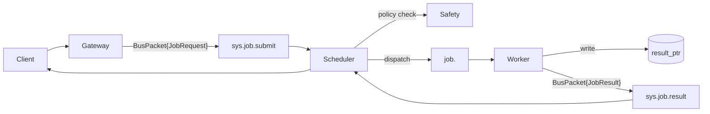
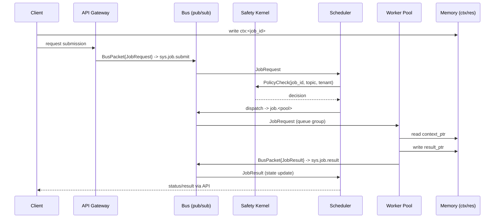

# Cordum Agent Protocol (CAP)

[](https://github.com/cordum-io/cap/actions/workflows/ci.yml)
[](LICENSE)
[](https://pkg.go.dev/github.com/cordum-io/cap/v2)
[](https://discord.gg/U4NpXtjP)

> **New to CAP?** Follow the [Getting Started in 5 Minutes](docs/getting-started.md) guide to go from zero to a running job.

## TL;DR
- Cluster-native job protocol for AI agents: standard envelopes, jobs, heartbeats, and workflows over a bus.
- Keeps payloads off the wire via `context_ptr` and `result_ptr` so the bus stays lean and secure.
- Safety is built-in: schedulers call a Safety Kernel to allow/deny/throttle before dispatch.
- Works with any pub/sub that supports subjects and competing consumers (NATS by default, Kafka acceptable).
- Compatible with workers, orchestrators, gateways, schedulers, and external clients in mixed deployments.
- CAP is the Translator and the Guard. It forces the chaotic, creative LLM to behave like a reliable, boring software component.

## Status
- Protocol (wire): CAP 1.0.0 — Stable; append-only changes only.
- Implementation / SDK: cap v2.0.19 (tagged releases in this repo).
- Transport profile: NATS-first; other buses experimental.
- Reference implementation: Cordum.

### Versioning at a glance
| Component | Version | Notes |
| --- | --- | --- |
| Protocol wire schema | 1.0.0 | Append-only evolution; never renumber fields. |
| Repo / SDKs | 2.0.19 | Go/Python/Node/C++ SDKs and docs; pinned by tag. |
| `protocol_version` field | 1 | Used in `BusPacket` for negotiation. |

## MCP != CAP
- MCP = single-model tool protocol.
- CAP = distributed multi-agent execution protocol (scheduler + pools + safety + state machine).
- MCP focuses on tool-calling; CAP standardizes the control plane for clusters (jobs, heartbeats, workflows).

## Architecture


### Sequence (with pointers)


## Key Concepts in 60 Seconds
- **BusPacket**: single envelope for everything on the bus.
- **Jobs**: `JobRequest` (submit) + `JobResult` (complete), with workflow metadata (`workflow_id`, `parent_job_id`, `step_index`).
- **Pointers**: `context_ptr`, `result_ptr`, `redacted_context_ptr` keep the bus free of blobs.
- **Heartbeats**: worker liveness, load, pool membership, and capacity.
- **Checkpoint heartbeats**: optional progress checkpoints (`progress_pct`, `last_memo`) for long tasks.
- **Compensation**: optional inverse actions on `JobRequest` to support durable rollback.
- **Safety Kernel**: allow/deny/human/throttle hook invoked before dispatch.
- **State machine**: `PENDING -> SCHEDULED -> DISPATCHED -> RUNNING -> {SUCCEEDED|FAILED|FAILED_RETRYABLE|FAILED_FATAL|TIMEOUT|DENIED|CANCELLED}`.
- **Workflows**: orchestrators fan out child jobs and publish a parent result without changing the core job shape.

## Protocol Contracts
Canonical protobuf definitions live under `proto/cordum/agent/v1/`:
- `buspacket.proto` — envelope and payload selection.
- `job.proto` — job request/result messages and enums.
- `heartbeat.proto` — liveness and capacity signals.
- `safety.proto` — Safety Kernel gRPC surface.
- `alert.proto` — lightweight system alerts.
- `BusPacket.signature` — optional digital signature for authenticity; SDK helpers sign/verify envelopes when provided keys.

## Examples
- `examples/simple-echo/` — smallest possible job submission + result with bus messages and sequence (Go/Python/Node).
- `examples/workflow-repo-review/` — parent/child workflow with aggregation.
- `examples/heartbeat.json` — standalone heartbeat sample.
- `examples/README.md` — quick pointers to all flows.

## High-Level Runtime SDKs
The runtime layer hides NATS/Redis plumbing and gives you typed handlers. Not sure which SDK? See the [SDK Comparison Matrix](docs/sdk-comparison.md).

Python:
```python
import asyncio
from pydantic import BaseModel
from cap.runtime import Agent, Context

class Input(BaseModel):
    prompt: str

class Output(BaseModel):
    summary: str

agent = Agent(retries=2)

@agent.job("job.summarize", input_model=Input, output_model=Output)
async def summarize(ctx: Context, data: Input) -> Output:
    return Output(summary=data.prompt[:140])

asyncio.run(agent.run())
```

Node/TypeScript:
```ts
import { z } from "zod";
import { Agent } from "./runtime";

const Input = z.object({ prompt: z.string() });
const Output = z.object({ summary: z.string() });

const agent = new Agent({ retries: 2 });
agent.job("job.summarize", Input, async (_ctx, data) => {
  return { summary: data.prompt.slice(0, 140) };
}, { outputSchema: Output });

agent.run().catch(console.error);
```

Go:
```go
type Input struct {
    Prompt string `json:"prompt"`
}

type Output struct {
    Summary string `json:"summary"`
}

agent := &runtime.Agent{Retries: 2}
runtime.Register(agent, "job.summarize", func(ctx runtime.Context, input Input) (Output, error) {
    return Output{Summary: input.Prompt[:140]}, nil
})
if err := agent.Start(); err != nil {
    log.Fatal(err)
}
select {}
```

## Hello Worker (Go, 20 lines)
```go
package main

import (
	"log"

	agentv1 "github.com/cordum-io/cap/v2/cordum/agent/v1"
	"github.com/nats-io/nats.go"
	"google.golang.org/protobuf/proto"
)

func main() {
	// Connect to a NATS server.
	nc, _ := nats.Connect("nats://127.0.0.1:4222")
	defer nc.Drain()

	// Subscribe to the "job.echo" subject and join the "job.echo" queue group.
	_, _ = nc.QueueSubscribe("job.echo", "job.echo", func(msg *nats.Msg) {
		// Unmarshal the received message into a BusPacket.
		var pkt agentv1.BusPacket
		_ = proto.Unmarshal(msg.Data, &pkt)

		// Get the JobRequest from the packet.
		req := pkt.GetJobRequest()

		// Create a JobResult.
		res := &agentv1.JobResult{
			JobId:     req.GetJobId(),
			Status:    agentv1.JobStatus_JOB_STATUS_SUCCEEDED,
			ResultPtr: "redis://res/" + req.GetJobId(),
			WorkerId:  "echo-1",
		}

		// Create the response BusPacket.
		out, _ := proto.Marshal(&agentv1.BusPacket{
			TraceId:         pkt.GetTraceId(),
			SenderId:        "echo-1",
			ProtocolVersion: 1,
			Payload:         &agentv1.BusPacket_JobResult{JobResult: res},
		})

		// Publish the response.
		_ = nc.Publish("sys.job.result", out)
	})

	// Block forever.
	select {}
}
```

## Repo Map
- `spec/` - normative spec: envelopes, jobs, pointers, heartbeats, safety, state, workflows, transport, security.
- `spec/conformance/` - binary fixtures for cross-SDK conformance tests.
- `proto/` - protobuf contracts (copy/paste ready).
- `examples/` - JSON and sequence flows for common scenarios.
- `tools/` - helper scripts for proto generation (optional).
- `sdk/` - starter SDKs for Go, Python, Node/TS, and C++ with NATS helpers.
- `docs/sdk-comparison.md` - SDK comparison matrix: which SDK to use and when.
- `cordum/` - Go protobuf stubs (import path `github.com/cordum-io/cap/v2/cordum/agent/v1`).
- `python/` - Python protobuf stubs (enable with `CAP_RUN_PY=1`).
- `cpp/` - C++ protobuf stubs (vendored headers/sources).
- `node/` - Node JS protobuf stubs (CommonJS, binary wire format).
- `docs/troubleshooting.md` - common issues and solutions.
- Go module path: `github.com/cordum-io/cap/v2` (see `go.mod`).

## Community

Having issues? Check the [Troubleshooting Guide](docs/troubleshooting.md).

- **Discord:** [Join our Discord server](https://discord.gg/U4NpXtjP)
- **GitHub Discussions:** [Ask questions and share ideas](https://github.com/cordum-io/cap/discussions)
- **Email:** admin@cordum.io

## Compatibility and Contributing
- Wire evolution is append-only: never renumber or repurpose existing protobuf fields.
- `protocol_version` (currently `1`) is used for negotiation; tag releases when message shapes change.
- See `CONTRIBUTING.md` for workflow and style guidance.

## CAP Conformance Checklist
- Use `BusPacket` envelopes with stable `trace_id` across workflows and children.
- Keep blobs off the bus: use `context_ptr`, `result_ptr`, and `redacted_context_ptr`.
- Emit `JobRequest` with workflow links (`workflow_id`, `parent_job_id`, `step_index`) when fanning out.
- Heartbeat on `sys.heartbeat` with pool/region and capacity.
- Run Safety checks (allow/deny/human/throttle) before dispatch.
- Assume at-least-once delivery; make handlers idempotent on `job_id` + pointers.

## Why CAP (and not just MCP)
- MCP assumes a single model calling local tools; it does not cover scheduling, state reconciliation, safety hooks, or distributed pools.
- CAP fixes the control-plane gaps: job lifecycle, pool routing, heartbeats, policy, and transport profile.
- MCP != CAP. They can coexist: MCP can be the tool layer inside a CAP worker.

## License
Apache-2.0 (`LICENSE`).
