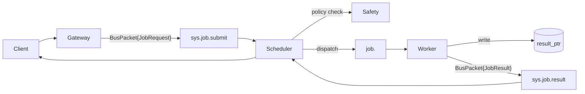

# Cordum Agent Protocol (CAP)

[](https://github.com/cordum-io/cap/actions/workflows/ci.yml)
[](LICENSE)
[](https://pkg.go.dev/github.com/cordum-io/cap/v2)
[](https://discord.gg/U4NpXtjP)

> CAP is the execution and governance layer for agent workloads — complementary to A2A (agent collaboration) and MCP (tools and context). See [how CAP fits](docs/ecosystem.md).

AI agents are breaking out of single-model sandboxes into distributed clusters — but there's no standard for how they coordinate, stay safe, or report health. Teams end up hand-rolling job routing, liveness checks, and safety gates, then rewriting it all when they add a second orchestrator.

CAP is the open wire protocol that fixes this. It gives every agent cluster jobs, heartbeats, safety hooks, and workflows over a NATS message bus — so you ship agents instead of plumbing.

## What CAP Gives You

- **Cluster-native** — subjects, queue groups, heartbeats, and pools baked in.
- **Policy hook** — a Safety Kernel hook can allow / deny / route to a human / throttle before dispatch. It is a hook you wire up, not an automatic guarantee.
- **Payload-light** — pointers (`context_ptr`, `result_ptr`) keep data off the bus.
- **Workflow-ready** — parent/child jobs with full traceability across steps.
- **Open** — Apache-2.0, with stable Go, Node, and Python SDKs. NATS is the supported transport; other buses are experimental.

## How CAP fits with MCP and A2A

CAP is complementary to the other agent standards, not a competitor:

- **A2A** — peer agent discovery, collaboration, and task/artifact exchange.
- **MCP** — tools, resources, and prompts for a model or agent (an MCP client can run inside a CAP worker).
- **CAP** — broker-native governed workload admission, dispatch, worker-pool capacity/liveness, attempt fencing/retry, and workflow execution.

CAP adds the operational layer — policy-checked admission, pool routing, heartbeats, retries, and workflows — that A2A and MCP do not define. See [CAP in the agent ecosystem](docs/ecosystem.md) for the full picture and a "CAP is not" section, and [Why CAP](docs/WHY_CAP.md) for the design rationale.

## Run CAP Locally

Start with the one-command [Docker Compose playground](playground/):

```bash
cd playground
docker compose up --build --abort-on-container-exit --exit-code-from submit
```

The playground is a direct local-development transport lab. It starts NATS, an echo worker,
and a submitter, then exits successfully only after the submitter validates a matching
`JOB_STATUS_SUCCEEDED` result. It does not start the governed Cordum control plane.

Next, follow [Getting Started](docs/getting-started.md) to build and run the same local job
round-trip in Go, Python, or Node.

Other examples:

- [`examples/simple-echo/`](examples/simple-echo/) — direct local-development job round-trip (Go / Python / Node)
- [`examples/workflow-repo-review/`](examples/workflow-repo-review/) — parent/child workflow with aggregation

## Install an SDK

The package names below install the current public release. The first-job guide in this
**Unreleased** tree requires the candidate artifacts it documents; use registry packages for
that guide only after release notes explicitly include the onboarding and package repairs.

**Python:**
```bash
pip install cap-sdk-python
```

**Node / TypeScript:**
```bash
npm install cap-sdk-node
```

**Go:**
```bash
go get github.com/cordum-io/cap/v2
```

Not sure which SDK? See the [SDK Comparison Matrix](docs/sdk-comparison.md).

### Runtime Example (Python)

```python
import asyncio
from pydantic import BaseModel
from cap.runtime import Agent, Context

class Input(BaseModel):
    prompt: str

class Output(BaseModel):
    summary: str

agent = Agent(retries=2)

@agent.job("job.summarize", input_model=Input, output_model=Output)
async def summarize(ctx: Context, data: Input) -> Output:
    return Output(summary=data.prompt[:140])

asyncio.run(agent.run())
```

The minimal local example uses the SDK's legacy/off compatibility path. It does
not establish an authenticated worker session and must not be treated as a
production trust configuration.

## Authenticated Worker Sessions

The unreleased Go, Python, and Node runtime sources implement the CAP v1 signed
worker challenge/authenticate exchange over core NATS request/reply. A worker
proves possession of an enrolled P-256 key, pins the scheduler signing identity,
and receives an opaque short-lived `BusPacket.auth_token` bound to the exact
`cordum-scheduler` audience plus its authoritative worker, agent, tenant, and
key records. RENEW signs the current live token and never falls back to ISSUE.

Proof-key enrollment, rotation, and revocation are control-plane operations:
register only the public key, keep private material in the worker, overlap key
pins during rotation, and revoke/supersede old records in the shared authority.
Packets cannot self-enroll a key or choose identity/allowed-topic bindings.

Runtime migration modes are:

- `off`: legacy compatibility; no proof-bound session;
- `warn`: strict exchange verification with worker-local migration availability;
  tokenless registry input remains telemetry-only and cannot refresh dispatch
  authority;
- `enforce`: a live verified session is required for admission.

WARN never accepts an invalid signature or result and never labels tokenless
capability/readiness state authenticated. Public low-level builders, codecs,
signers, verifiers, and standalone `sys.handshake` helpers exist for adapters
and compatibility; they do not enroll keys, issue/revoke sessions, or authorize
dispatch. See [Capability Negotiation](spec/14-capability-negotiation.md),
[Security and Observability](spec/10-security-observability.md), and the
[Go runtime guide](sdk/go/runtime/README_HANDSHAKE.md).

## Governed Deployment Architecture

Production deployments add the Gateway, Scheduler, and Safety Kernel between submission and
worker dispatch. Those components are not part of the local playground or simple-echo lab.



## Release Status

<!-- cap-release:begin:release-status -->
- **Current release:** 2.15.0 (tag `v2.15.0`, 2026-07-20, channel stable)
- **Wire protocol:** 1 (compatible range 1–1)
- **Wire schema:** 1.0.0
- **Specifications:** 19 normative documents
<!-- cap-release:end -->

## Learn More

| Resource | Description |
| --- | --- |
| [Playground](playground/) | Run the direct local-development round-trip with Docker Compose |
| [Getting Started](docs/getting-started.md) | Build a local client and worker in Go, Python, or Node |
| [Why CAP](docs/WHY_CAP.md) | The problem CAP solves and design rationale |
| [Spec](spec/00-index.md) | Full normative specification |
| [Examples](examples/) | Job submissions, workflows, heartbeats |
| [SDK Comparison](docs/sdk-comparison.md) | Which SDK to use and when |
| [Technical Reference](docs/reference.md) | Protocol contracts, conformance, repo map |
| [Troubleshooting](docs/troubleshooting.md) | Common issues and solutions |

## Reference Implementations

- **[Cordum](https://github.com/cordum-io/cordum)** — Full Agent Control Plane implementing CAP: API Gateway, Scheduler, Safety Kernel, and Workflow Engine.
- **[cordum-packs](https://github.com/cordum-io/cordum-packs)** — 26+ integration packs (Slack, GitHub, AWS, Jira, and more) with framework adapters for LangChain, CrewAI, and AutoGen. Browse the catalog at [packs.cordum.io](https://packs.cordum.io).

## CAP Is for Everyone

CAP is Apache-2.0 licensed. Anyone can implement the protocol, build SDKs, or launch a conformant control plane. Wire evolution is append-only within the supported compatibility range (see [versioning policy](spec/17-versioning-policy.md)).

- [Contributing Guide](CONTRIBUTING.md)
- [Governance](GOVERNANCE.md)

## Community

- **Discord:** [Join our server](https://discord.gg/U4NpXtjP)
- **GitHub Discussions:** [Ask questions and share ideas](https://github.com/cordum-io/cap/discussions)
- **Email:** admin@cordum.io

## License

Apache-2.0 — see [LICENSE](LICENSE).
