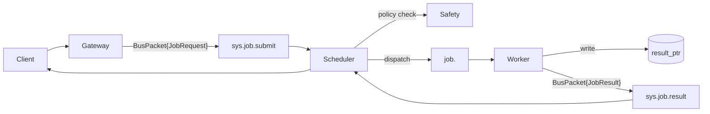

# Cordum Agent Protocol (CAP)

[](https://github.com/cordum-io/cap/actions/workflows/ci.yml)
[](LICENSE)
[](https://pkg.go.dev/github.com/cordum-io/cap/v2)
[](https://discord.gg/U4NpXtjP)

> **MCP defines what agents say. CAP defines what agents do.**

AI agents are breaking out of single-model sandboxes into distributed clusters — but there's no standard for how they coordinate, stay safe, or report health. Teams end up hand-rolling job routing, liveness checks, and safety gates, then rewriting it all when they add a second orchestrator.

CAP is the open wire protocol that fixes this. It gives every agent cluster jobs, heartbeats, safety hooks, and workflows over any pub/sub bus — so you ship agents instead of plumbing.

## What CAP Gives You

- **Cluster-native** — subjects, queue groups, heartbeats, and pools baked in.
- **Safe by default** — Safety Kernel hook for allow / deny / human-in-the-loop / throttle before dispatch.
- **Payload-light** — pointers (`context_ptr`, `result_ptr`) keep data off the bus; the wire stays lean and secure.
- **Workflow-ready** — parent/child jobs with full traceability across steps.
- **Vendor-neutral** — any bus, any language, Apache-2.0.

## MCP vs CAP

| Concern | MCP | CAP |
| --- | --- | --- |
| Scope | Single model calling local tools | Distributed multi-agent clusters |
| Scheduling | None | Pool routing, queue groups, retries |
| Safety | None | Pre-dispatch policy (allow/deny/human/throttle) |
| Liveness | None | Heartbeats with load and capacity |
| Workflows | None | Parent/child jobs, DAG steps, compensation |
| Transport | stdio / HTTP | Any pub/sub (NATS default, Kafka supported) |

MCP and CAP coexist: MCP can be the tool layer inside a CAP worker. See [Why CAP](docs/WHY_CAP.md) for the full rationale.

## Try It in 5 Minutes

Follow the [Getting Started](docs/getting-started.md) guide to go from zero to a running job.

Or jump straight to the examples:

- [`examples/simple-echo/`](examples/simple-echo/) — smallest possible job round-trip (Go / Python / Node)
- [`examples/workflow-repo-review/`](examples/workflow-repo-review/) — parent/child workflow with aggregation

## Install an SDK

**Python:**
```bash
pip install cap-sdk-python
```

**Node / TypeScript:**
```bash
npm install cap-sdk-node
```

**Go:**
```bash
go get github.com/cordum-io/cap/v2
```

Not sure which SDK? See the [SDK Comparison Matrix](docs/sdk-comparison.md).

### Runtime Example (Python)

```python
import asyncio
from pydantic import BaseModel
from cap.runtime import Agent, Context

class Input(BaseModel):
    prompt: str

class Output(BaseModel):
    summary: str

agent = Agent(retries=2)

@agent.job("job.summarize", input_model=Input, output_model=Output)
async def summarize(ctx: Context, data: Input) -> Output:
    return Output(summary=data.prompt[:140])

asyncio.run(agent.run())
```

## Architecture



## Learn More

| Resource | Description |
| --- | --- |
| [Getting Started](docs/getting-started.md) | Zero to running job in 5 minutes |
| [Why CAP](docs/WHY_CAP.md) | The problem CAP solves and design rationale |
| [Spec](spec/00-index.md) | Full normative specification (17 documents) |
| [Examples](examples/) | Job submissions, workflows, heartbeats |
| [SDK Comparison](docs/sdk-comparison.md) | Which SDK to use and when |
| [Technical Reference](docs/reference.md) | Protocol contracts, conformance, repo map |
| [Troubleshooting](docs/troubleshooting.md) | Common issues and solutions |

## Reference Implementations

- **[Cordum](https://github.com/cordum-io/cordum)** — Full Agent Control Plane implementing CAP: API Gateway, Scheduler, Safety Kernel, and Workflow Engine.
- **[cordum-packs](https://github.com/cordum-io/cordum-packs)** — 26+ integration packs (Slack, GitHub, AWS, Jira, and more) with framework adapters for LangChain, CrewAI, and AutoGen. Browse the catalog at [packs.cordum.io](https://packs.cordum.io).

## CAP Is for Everyone

CAP is Apache-2.0 licensed. Anyone can implement the protocol, build SDKs, or launch a conformant control plane. Wire evolution is append-only — existing integrations never break.

- [Contributing Guide](CONTRIBUTING.md)
- [Governance](GOVERNANCE.md)

## Community

- **Discord:** [Join our server](https://discord.gg/U4NpXtjP)
- **GitHub Discussions:** [Ask questions and share ideas](https://github.com/cordum-io/cap/discussions)
- **Email:** admin@cordum.io

## License

Apache-2.0 — see [LICENSE](LICENSE).
