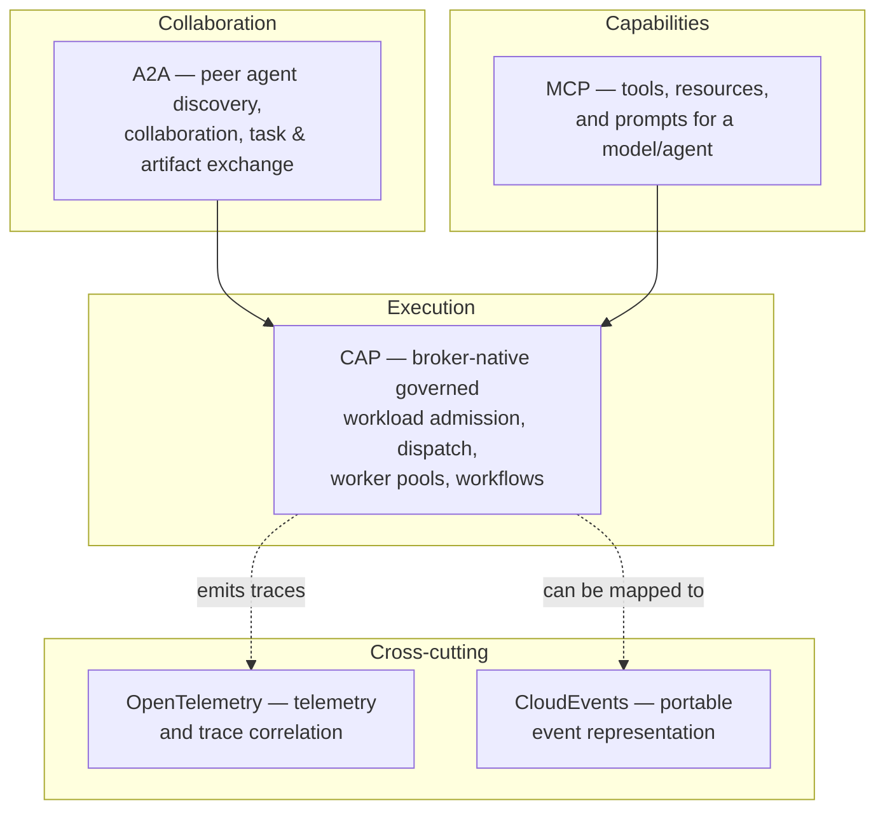

# CAP in the agent ecosystem

CAP is one layer in a stack of complementary open standards. It does not compete
with A2A or MCP — it sits alongside them and depends on none of them. This page
describes what each layer does, according to its current published specification,
and where CAP fits.

## The layers

### A2A (Agent2Agent)

A2A is a Linux Foundation-governed protocol for **agent-to-agent collaboration**:
agents advertise capabilities (Agent Cards), discover peers, and exchange tasks
and artifacts. A2A answers "which agent can help, and how do two agents talk?"

### MCP (Model Context Protocol)

MCP connects a host/model to **tools, resources, and prompts** through MCP
servers over stdio or Streamable HTTP. MCP answers "what capabilities and
context can this model reach?" An MCP client can live inside a CAP worker.

### CAP (Cordum Agent Protocol)

CAP is the **execution and governance** layer for distributed agent workloads on
a message broker. Its differentiator is broker-native operational concerns that
neither A2A nor MCP defines:

- job admission with policy checks before dispatch (Safety Kernel hook);
- routing to worker pools with queue groups;
- worker capacity and liveness via heartbeats;
- attempt fencing and retry semantics;
- multi-step workflow execution with parent/child correlation;
- payload-light envelopes (pointers keep blobs off the bus).

CAP answers "how is a governed workload admitted, dispatched, executed, and
tracked across a pool of workers?"

### OpenTelemetry

CAP carries a stable `trace_id` so activity correlates in an OpenTelemetry
backend. OpenTelemetry is **telemetry and correlation only**; it is **not**
authoritative for tenant, principal, or policy identity — those come from
authenticated transport/session records, never from a self-reported trace or
label.

### CloudEvents

CloudEvents is a portable **event envelope**. A CAP event can be represented as a
CloudEvent for interop with event-driven infrastructure. CloudEvents describes
event shape; it does not define admission, dispatch, or worker semantics.

## Operational scenarios

- **Governed tool call at scale.** An MCP client inside a CAP worker calls a
  tool. CAP admits the job through the Safety Kernel, dispatches it to the
  worker pool, fences the attempt, and records the terminal result — governance
  MCP itself does not provide.
- **Multi-agent task hand-off.** Two agents negotiate a task over A2A; the
  accepting agent runs the actual work as a CAP job so it is policy-checked,
  load-balanced across a pool, and retried on failure.
- **Correlated observability.** A workflow fans out child CAP jobs; each carries
  the parent `trace_id`, so the whole tree is reconstructable in an
  OpenTelemetry backend without CAP being the telemetry store.

## What CAP is not

CAP is deliberately narrow. CAP is **not**:

- a model or prompt API (that is the model provider / MCP);
- an agent framework or SDK-for-building-agents;
- a replacement for MCP or A2A — it complements them;
- a message broker — it runs **on** a broker (NATS today);
- a scheduler or control-plane **product** — it is the wire contract a control
  plane implements (Cordum is one such reference control plane);
- a blob store — payloads live behind pointers in external storage;
- a telemetry backend — it emits correlation data for OpenTelemetry;
- a generic event envelope — it is a job/execution protocol, not CloudEvents;
- a security guarantee **by conformance** — CAP defines safety and signing
  hooks, but conforming to CAP does not by itself make a deployment secure;
  operators must configure identity, policy, and key management.

## Transport support

- **NATS — supported.** Core NATS request/reply and pub/sub, exercised by an
  end-to-end job round-trip in CI (see `../spec/09-transport-profile.md`).
- **Kafka, RabbitMQ, and other buses — experimental.** No behavioral
  conformance evidence yet; not supported bindings until a transport
  conformance suite (TCK) demonstrates the required semantics.

The machine-readable transport status lives in `../release/manifest.json` and is
rendered into `reference.md`.

## Reference control plane

Cordum is a **reference control plane** that implements CAP (API Gateway,
Scheduler, Safety Kernel, Workflow Engine). CAP is the open protocol; Cordum is
one implementation of it. Anyone can implement CAP.

## Interoperability roadmap

The following are **roadmap**, not current CAP behavior, and are owned by the
interop-adapters work — do not treat them as shipped:

- an A2A ↔ CAP bridge;
- an MCP-client-in-CAP-worker reference demo;
- OpenTelemetry context propagation helpers;
- a CloudEvents export mapping;
- an AsyncAPI description of the CAP subjects.
