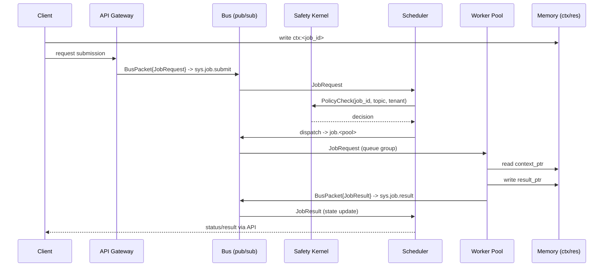

# CAP Technical Reference

Deep technical content for implementers. For an overview, see the [README](../README.md).

## Status

<!-- cap-release:begin:release-status -->
- **Current verified published release:** 2.14.0 (tag `v2.14.0`, 2026-06-02, channel stable)
- **Wire protocol:** 1 (compatible range 1–1)
- **Wire schema:** 1.0.0
- **Specifications:** 20 normative documents
- **Release candidate (not published):** 2.15.0 (tag `v2.15.0`, channel stable)
<!-- cap-release:end -->

- Reference implementation: Cordum.

### Transport Status

<!-- cap-release:begin:transport-table -->
| Transport | Status | Notes |
| --- | --- | --- |
| nats | supported | Core NATS request/reply and pub/sub per spec/09-transport-profile.md. |
| kafka | experimental | No behavioral conformance evidence yet; not a supported binding. |
| rabbitmq | experimental | No behavioral conformance evidence yet; not a supported binding. |
<!-- cap-release:end -->

## Key Concepts

- **BusPacket**: single envelope for everything on the bus.
- **Jobs**: `JobRequest` (submit) + `JobResult` (complete), with workflow metadata (`workflow_id`, `parent_job_id`, `step_index`).
- **Pointers**: `context_ptr`, `result_ptr`, `redacted_context_ptr` keep the bus free of blobs.
- **Heartbeats**: worker liveness, load, pool membership, and capacity.
- **Checkpoint heartbeats**: optional progress checkpoints (`progress_pct`, `last_memo`) for long tasks.
- **Compensation**: optional inverse actions on `JobRequest` to support durable rollback.
- **Safety Kernel**: allow/deny/human/throttle hook invoked before dispatch.
- **State machine**: `PENDING -> SCHEDULED -> DISPATCHED -> RUNNING -> {SUCCEEDED|FAILED|FAILED_RETRYABLE|FAILED_FATAL|TIMEOUT|DENIED|CANCELLED}`.
- **Workflows**: orchestrators fan out child jobs and publish a parent result without changing the core job shape.

## Protocol Contracts

Canonical protobuf definitions live under `proto/cordum/agent/v1/`:

- `buspacket.proto` — envelope and payload selection.
- `job.proto` — job request/result messages and enums.
- `heartbeat.proto` — liveness and capacity signals.
- `safety.proto` — Safety Kernel gRPC surface.
- `alert.proto` — lightweight system alerts.
- `BusPacket.signature` — optional digital signature for authenticity; SDK helpers sign/verify envelopes when provided keys.

## Sequence Diagram (with Pointers)



## Hello Worker (Go, 20 lines)

Minimal worker using raw NATS — no runtime SDK required:

```go
package main

import (
	"log"

	agentv1 "github.com/cordum-io/cap/v2/cordum/agent/v1"
	"github.com/nats-io/nats.go"
	"google.golang.org/protobuf/proto"
)

func main() {
	// Connect to a NATS server.
	nc, _ := nats.Connect("nats://127.0.0.1:4222")
	defer nc.Drain()

	// Subscribe to the "job.echo" subject and join the "job.echo" queue group.
	_, _ = nc.QueueSubscribe("job.echo", "job.echo", func(msg *nats.Msg) {
		// Unmarshal the received message into a BusPacket.
		var pkt agentv1.BusPacket
		_ = proto.Unmarshal(msg.Data, &pkt)

		// Get the JobRequest from the packet.
		req := pkt.GetJobRequest()

		// Create a JobResult.
		res := &agentv1.JobResult{
			JobId:     req.GetJobId(),
			Status:    agentv1.JobStatus_JOB_STATUS_SUCCEEDED,
			ResultPtr: "redis://res/" + req.GetJobId(),
			WorkerId:  "echo-1",
		}

		// Create the response BusPacket.
		out, _ := proto.Marshal(&agentv1.BusPacket{
			TraceId:         pkt.GetTraceId(),
			SenderId:        "echo-1",
			ProtocolVersion: 1,
			Payload:         &agentv1.BusPacket_JobResult{JobResult: res},
		})

		// Publish the response.
		_ = nc.Publish("sys.job.result", out)
	})

	// Block forever.
	select {}
}
```

## Repo Map

- `spec/` — normative spec: envelopes, jobs, pointers, heartbeats, safety, state, workflows, transport, security.
- `spec/conformance/` — binary fixtures for cross-SDK conformance tests.
- `proto/` — protobuf contracts (copy/paste ready).
- `examples/` — JSON and sequence flows for common scenarios.
- `tools/` — helper scripts for proto generation (optional).
- `sdk/` — starter SDKs for Go, Python, Node/TS, and C++ with NATS helpers.
- `launch-kit/` — marketing materials, diagrams, and brand assets.
- `docs/sdk-comparison.md` — SDK comparison matrix: which SDK to use and when.
- `cordum/` — Go protobuf stubs (import path `github.com/cordum-io/cap/v2/cordum/agent/v1`).
- `python/` — Python protobuf stubs (enable with `CAP_RUN_PY=1`).
- `cpp/` — C++ protobuf stubs (vendored headers/sources).
- `node/` — Node JS protobuf stubs (CommonJS, binary wire format).
- `docs/troubleshooting.md` — common issues and solutions.
- Go module path: `github.com/cordum-io/cap/v2` (see `go.mod`).

## CAP Conformance Checklist

- Use `BusPacket` envelopes with stable `trace_id` across workflows and children.
- Keep blobs off the bus: use `context_ptr`, `result_ptr`, and `redacted_context_ptr`.
- Emit `JobRequest` with workflow links (`workflow_id`, `parent_job_id`, `step_index`) when fanning out.
- Heartbeat on `sys.heartbeat` with pool/region and capacity.
- Run Safety checks (allow/deny/human/throttle) before dispatch.
- Assume at-least-once delivery; make handlers idempotent on `job_id` + pointers.

## Compatibility and Contributing

- Wire evolution is append-only: never renumber or repurpose existing protobuf fields.
- `protocol_version` (currently `1`) is used for negotiation; tag releases when message shapes change.
- See [CONTRIBUTING.md](../CONTRIBUTING.md) for workflow and style guidance.
