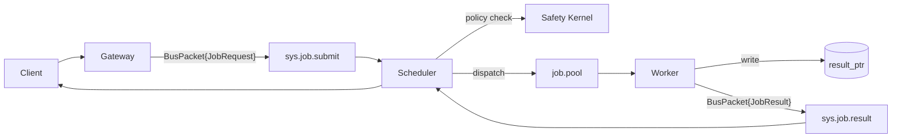

# Introducing CAP — The Missing Governance Layer for AI Agents

**MCP solved agent communication. CAP solves agent governance.**

If you've deployed more than one AI agent, you've probably felt the gap. MCP gives your model a way to call tools. But who decides whether a tool call is *safe*? Who schedules competing requests across a pool of agents? Who tracks whether agent-42 is still alive, or whether a three-step workflow completed without dropping a result on the floor?

Nobody — unless you built it yourself. And that's the problem CAP was created to fix.

## The Multi-Agent Governance Gap

The agent landscape is evolving fast. Teams are moving from single-model demos to distributed clusters: pools of specialized agents handling financial operations, data pipelines, customer service, and infrastructure automation. The moment you cross that threshold, a set of unsolved problems appears:

**No scheduling standard.** When multiple agents compete for work, you need queue groups, pool routing, priority lanes, and retry policies. Most teams hand-roll this on top of their message broker and rewrite it when they add a second orchestrator.

**No safety layer.** Every agent action is a potential risk. Deleting files, sending emails, executing financial transfers — without a pre-dispatch policy hook, these happen unchecked. Teams bolt on ad-hoc validators that drift out of sync with their actual risk profile.

**No state reconciliation.** What happens when an agent crashes mid-job? Without a standard state machine, there's no way to distinguish between "running," "timed out," and "failed but retryable." Teams build fragile monitoring that misses edge cases.

**No wire-level governance.** MCP inlines payloads in every message. At cluster scale, that means sensitive data traversing the bus in plaintext. There's no standard for pointer-based memory isolation, no heartbeat protocol, no workflow metadata for parent-child job tracing.

These aren't theoretical concerns. They're the reasons 40% of enterprise agentic AI projects get canceled, according to Gartner.

## What CAP Is

The **Cordum Agent Protocol (CAP)** is an open wire protocol — Apache-2.0 licensed — that standardizes how gateways, schedulers, workers, orchestrators, and safety services exchange jobs over a pub/sub bus.

CAP is built on five pillars:

### 1. BusPacket Envelope

Every message on the bus is a `BusPacket` — a protobuf envelope carrying a `trace_id`, `sender_id`, `protocol_version`, and exactly one payload. The payload is a `JobRequest`, `JobResult`, `Heartbeat`, or `SystemAlert`. One envelope format, one serialization contract, zero ambiguity.

### 2. Job Lifecycle

Jobs follow a deterministic state machine: `PENDING → SCHEDULED → DISPATCHED → RUNNING → SUCCEEDED | FAILED | TIMEOUT | DENIED | CANCELLED`. Every transition is explicit. Retryable failures are distinguished from fatal ones. There is no "unknown" state.

### 3. Pointer-Based Memory

CAP keeps payloads off the wire. Inputs are written to external memory (Redis, S3, a database) and referenced via `context_ptr`. Results are written the same way via `result_ptr`. The bus carries only envelopes — keeping it lean, fast, and secure. Sensitive data never traverses the message bus in cleartext.

### 4. Safety Kernel

Before any job is dispatched, the scheduler calls a Safety Kernel — a dedicated policy decision point. The kernel evaluates the job's topic, capability, risk tags, and tenant context, then returns one of four decisions:

- **ALLOW** — execute immediately
- **DENY** — block and record the reason
- **REQUIRE_APPROVAL** — pause for human-in-the-loop sign-off
- **THROTTLE** — delay execution by a configured duration

Safety is not optional. It's a protocol-level requirement.

### 5. Workflows

CAP supports orchestrated parent-child job graphs using `workflow_id`, `parent_job_id`, and `step_index` metadata on every `JobRequest`. An orchestrator is just a worker that spawns child jobs and aggregates their results — no special infrastructure required.



## MCP vs CAP — Complementary, Not Competing

MCP and CAP solve different layers of the agent stack:

| Concern | MCP | CAP |
| --- | --- | --- |
| **Scope** | Single model calling local tools | Distributed multi-agent clusters |
| **Payload** | Inlined in every call | Pointer-based, off the wire |
| **Safety** | None | Pre-dispatch Safety Kernel |
| **State** | No lifecycle | Deterministic state machine |
| **Scheduling** | None | Pool routing, queue groups, retries |
| **Workflows** | Single call | Parent/child jobs with DAG steps |
| **Transport** | stdio / HTTP | Any pub/sub (NATS, Kafka) |

These protocols coexist naturally. MCP defines how an agent talks to its tools. CAP defines how the enterprise governs the agent. You can run MCP inside a CAP worker — the tool-calling layer stays the same, but every invocation is wrapped in governance.

## Get Started in 5 Minutes

CAP is designed to be runnable before it's readable. The fastest path:

**Docker Playground** — spin up a NATS bus, an echo worker, and a job submitter in one command:

```bash
cd playground && docker compose up
```

Watch a `BusPacket{JobRequest}` flow through the bus, get processed by the worker, and return a `BusPacket{JobResult}` — the full CAP lifecycle in 3 seconds.

**Install an SDK** and build your own worker:

```bash
pip install cap-sdk-python     # Python
npm install cap-sdk-node       # Node/TypeScript
go get github.com/cordum-io/cap/v2  # Go
```

**Read the spec** — 17 normative documents covering envelopes, jobs, pointers, heartbeats, safety, state machines, workflows, transport profiles, and security: [`spec/00-index.md`](https://github.com/cordum-io/cap/blob/main/spec/00-index.md).

## The Road Ahead

CAP v1.0 is stable — the wire format is frozen, append-only, and ready for production. The reference implementation is [Cordum](https://github.com/cordum-io/cordum), a full Agent Control Plane with API Gateway, Scheduler, Safety Kernel, and Workflow Engine.

We're actively building:

- **Framework integrations** — governance guards for LangChain, CrewAI, and AutoGen via the [python-guard SDK](https://github.com/cordum-io/cap/tree/main/sdk/python-guard)
- **Integration packs** — 26+ production-ready connectors for Slack, GitHub, AWS, Jira, and more at [packs.cordum.io](https://packs.cordum.io)
- **Community governance** — transparent protocol stewardship with a stability pledge and open contribution process

CAP is Apache-2.0 licensed. Anyone can implement the protocol, build SDKs, or launch a conformant control plane.

**The gap between "agents can do the work" and "agents are safe to deploy" is a protocol problem. CAP is the protocol.**

[GitHub](https://github.com/cordum-io/cap) · [Discord](https://discord.gg/U4NpXtjP) · [Spec](https://github.com/cordum-io/cap/blob/main/spec/00-index.md) · admin@cordum.io
